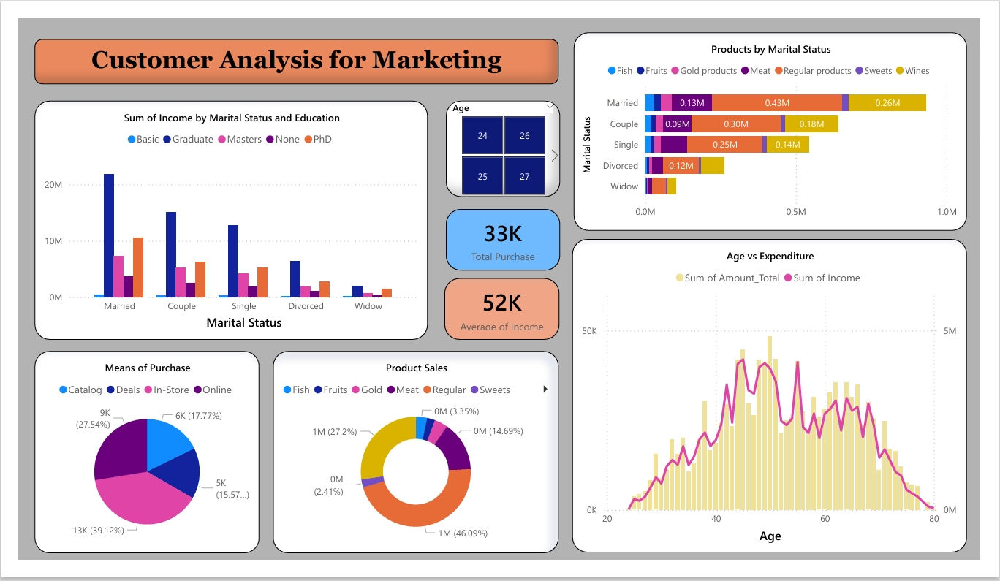
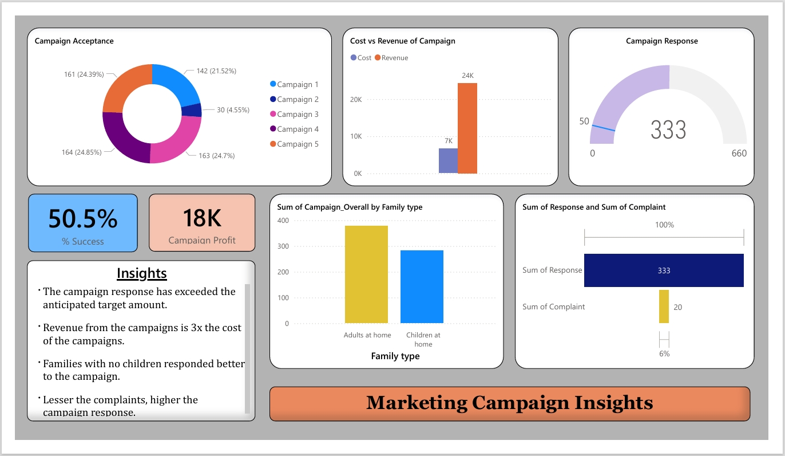

# 📊 Customer Analysis & Marketing Campaign Insights - Power BI Project

## 📌 Project Overview
This Power BI project analyzes customer purchasing behavior and evaluates the performance of marketing campaigns using the **iFood dataset**.  
The dashboards provide deep insights into **customer demographics, product sales, expenditure trends, and campaign success rates**.  

The project is divided into two main dashboards:
1. **Customer Analysis Dashboard**
2. **Marketing Campaign Insights Dashboard**

---

## 🖼️ Dashboards

### 1️⃣ Customer Analysis for Marketing
- **Sum of Income by Marital Status and Education**
- **Products Purchased by Marital Status**
- **Means of Purchase** (Catalog, Deals, In-store, Online)
- **Product Sales Distribution**
- **Age vs Expenditure**
- **Key Metrics:**
  - `33K` → Total Purchases  
  - `52K` → Average Income  

📌 *Screenshot:*  


---

### 2️⃣ Marketing Campaign Insights
- **Campaign Acceptance Rate by Campaign**
- **Cost vs Revenue of Campaigns**
- **Campaign Response & Success Rate**
- **Campaign Response by Family Type (Adults vs Children at home)**
- **Response vs Complaints**
- **Key Metrics:**
  - `50.5%` → Campaign Success Rate  
  - `18K` → Campaign Profit  

📌 *Screenshot:*  


---

## 📂 Repository Structure
```
Customer-Analysis-PowerBI/
├── ifood_df.xlsx                 # Dataset used for analysis
├── Customer_Analysis.pbix        # Power BI report file (if shared)
├── Dashboard1.jpeg                # Customer Analysis Dashboard screenshot
├── Dashboard2.jpeg                # Marketing Campaign Insights screenshot
└── README.md                      # Project documentation
```

---

## 🔑 Key Insights
- **Married and graduate customers** generate the highest income.  
- **Regular products and gold products** are the most purchased items.  
- Customers aged **30–50** show the highest expenditure.  
- **Families without children** responded better to marketing campaigns.  
- Campaign revenue is approximately **3x higher than campaign costs**.  
- **Lower complaint rates** lead to **higher campaign responses**.  

---

## 🚀 Tools Used
- **Power BI** → Data visualization and dashboard creation  
- **Excel (ifood_df.xlsx)** → Dataset source and preprocessing  

---

## 📈 How to Use
1. Download or clone this repository.  
2. Open the `Customer_Analysis.pbix` file in **Power BI Desktop**.  
3. Load the dataset (`ifood_df.xlsx`) if required.  
4. Explore and interact with the dashboards.  

---

## 📬 Contact
Created by **Munesula Vamshi**  
🔗 Connect with me on [LinkedIn--> https://www.linkedin.com/in/munesula-vamshi | [GitHub--> https://github.com/Vamshi-123-cpu]
